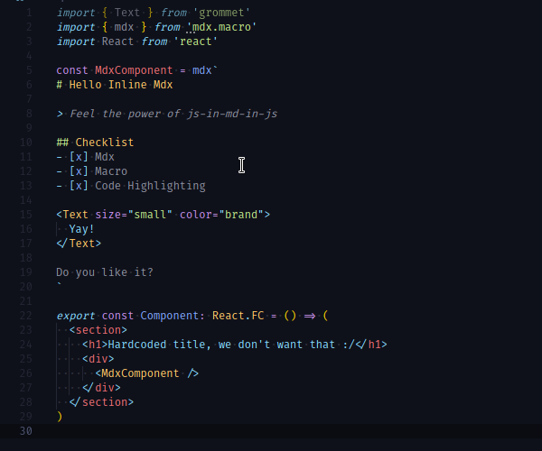

# Inline MDX for Visual Studio Code

> Adds [MDX](https://github.com/mdx-js/mdx) highlighting in inline tagged template literals.

## Installation

- Install vscode [MDX language support](https://marketplace.visualstudio.com/items?itemName=silvenon.mdx) (or it will be installed for you)
- Install this extension to use MDX in tagged template literals

## Usage

You can collocate MDX with your code and use [mdx.macro](https://www.npmjs.com/package/mdx.macro) or [inline-mdx.macro](https://www.npmjs.com/package/inline-mdx.macro) to render your markup as html (via [@mdx-js/tag](https://www.npmjs.com/package/@mdx-js/tag)).

All instances of `mdx` or `inline` tagged tamplates will be detected as embeded mdx.

```tsx
import React from 'react'
import { mdx } from 'mdx.macro'

const MDXContent = mdx`
  # Hello

  This will be nicely colored!
`

export const Component = () => (
  <div>
    <MDXContent />
  </div>
)
```

## Why

> So why on earth anyone would need js-in-markdown-in-js?

It's the same idea as usage of `graphql` or `css`/`styled` tagged template literals. Mdx files are great for whole articles, but what if you just need a few lines? Or want to split your content?

This extension adds to your editor markdown/mdx highlighting (and whatever mdx support) in tagged template literals.

## Example


